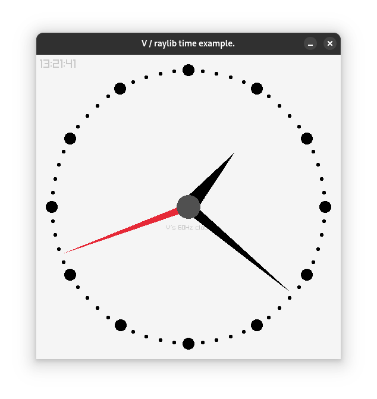

# vclock
This program is a simple clock (ala xclock) written using raylib
binding to V language.

raylib is a simple and easy-to-use library to enjoy videogames programming (https://www.raylib.com/).
V is Simple, fast, safe, compiled. For developing maintainable software (https://vlang.io/)..

To compile the program from within source directory:

v -prod .

Raylib  module must be installed: https://vpm.vlang.io/packages/raylib
or on GitHub: https://github.com/vlang/raylib

This program is released under MIT license.

